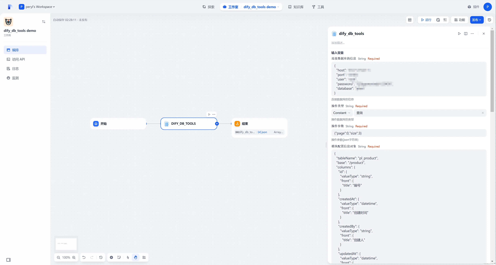
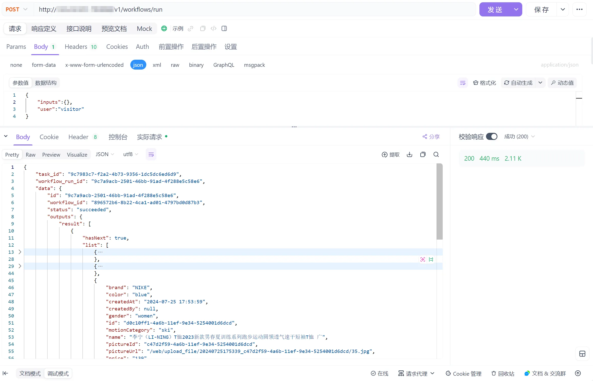
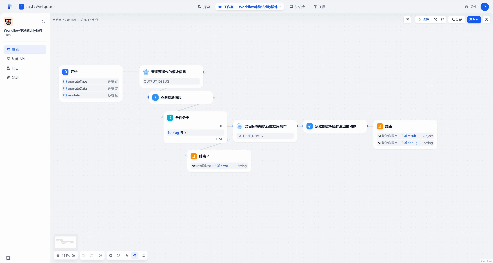
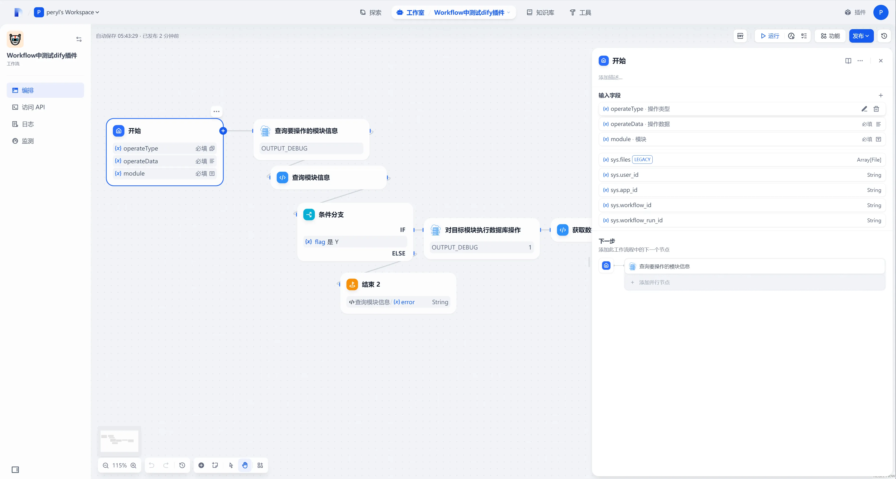
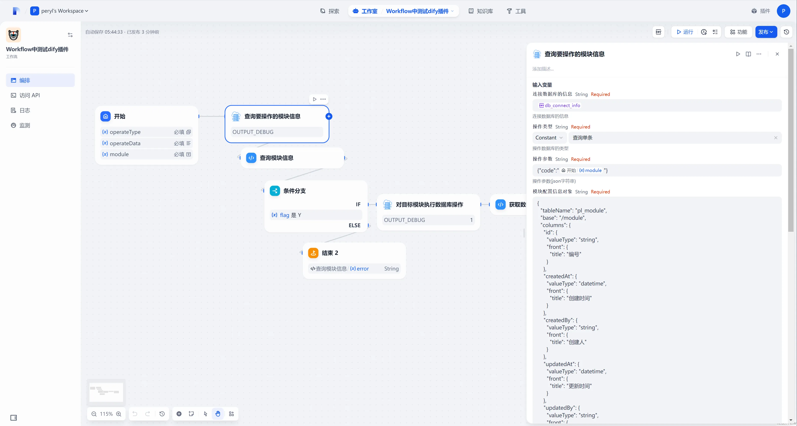
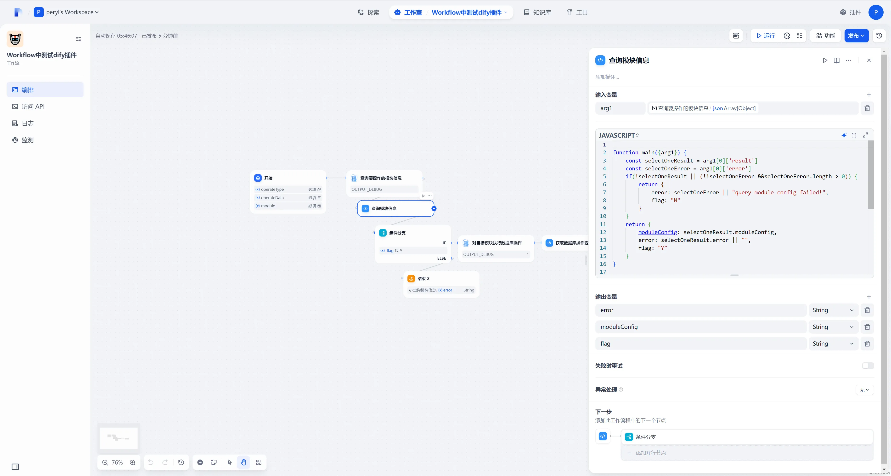
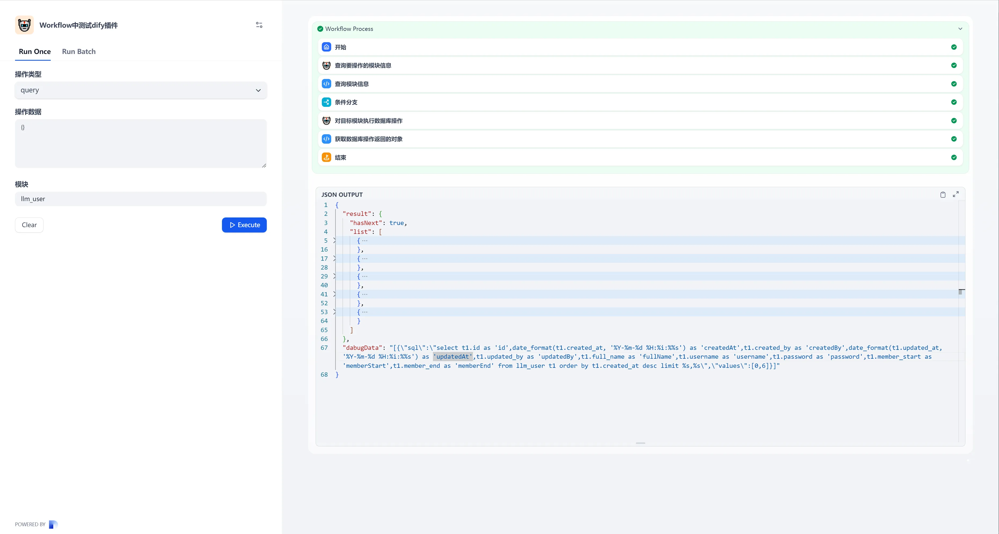
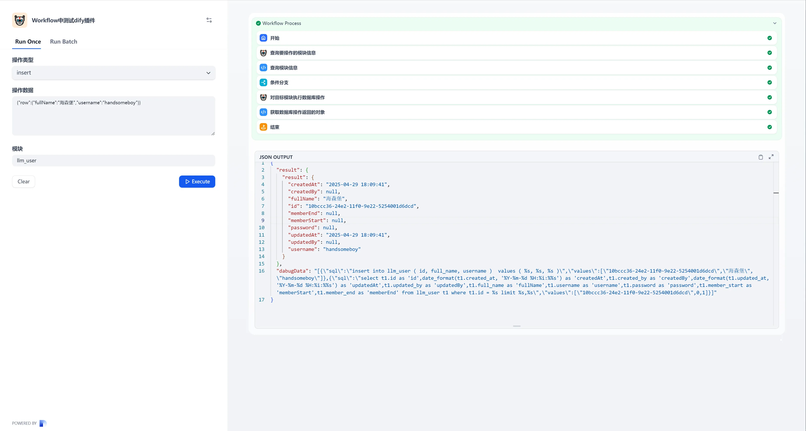
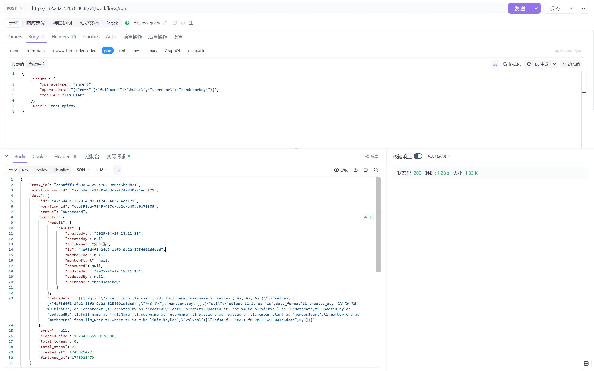

**Author:** perylliame  
**Version:** 0.0.1  
**Type:** tool

### Description

[Alternative document address](https://gitee.com/peryl/dify_db_tools/blob/master/README.md)

dify_db_tools is a database connection tool. Based on the orchestration engine of the Dify platform, it can quickly implement enhanced functions of adding, deleting, modifying and querying by connecting to databases such as MySQL and MariaDB. Thus, it enables the orchestration of complex business functions within Dify workflow applications. The following first introduces a simple case. As shown
below, after adding the tool in the orchestration process, configure the tool information:

1. Database connect info: a JSON object that should include "host" (the database host address), "port" (the database listening port), "user" (the username for connecting to the database), "password" (the password for connecting to the database), and "database" (the name of the connected database).
2. Operate Type: query, single query, create, update, delete, batch create, and batch update. There are a total of seven operation types in all.
3. Operate Data: a JSON object containing the parameters for performing the operation. For example, if it is a query operation, the operation parameters are the query parameters, including the query page number, the number of data items per page, filtering parameters, sorting parameters, deduplication settings, and whether to query only the total count, etc. A detailed introduction will
   follow later.
4. Module Config: a JSON object used to describe the table structure information. SQL statements for adding, deleting, modifying, and querying will be generated based on this table structure information.
5. Output debugging information: Set it to "True" when you need to query and return the executed SQL and the execution parameters.

For example, if you want to perform an operation to query the data in this table and retrieve the first 3 rows of data:



Execution result:


You can also use an interface calling tool to execute the workflow and obtain the execution result.



### Declaration

This plugin only requires sensitive data such as database connection information and table structure information during the configuration stage. It will only use these data to connect to the database and perform operations on the database tables, and will not collect any other sensitive data, such as personal information, usernames and passwords, email addresses, etc. Moreover, there will be no
behavior of uploading any data to any server, and the code is completely open-source and subject to market supervision.

### Module Config

The following is a simple JSON description of the structure information of a product table:

```json
{
  "tableName": "pl_product",
  "base": "/product",
  "columns": {
    "id": {
      "valueType": "string",
      "front": {
        "title": "编号"
      }
    },
    "createdAt": {
      "valueType": "datetime",
      "front": {
        "title": "创建时间"
      }
    },
    "createdBy": {
      "valueType": "string",
      "front": {
        "title": "创建人"
      }
    },
    "updatedAt": {
      "valueType": "datetime",
      "front": {
        "title": "更新时间"
      }
    },
    "updatedBy": {
      "valueType": "string",
      "front": {
        "title": "更新人"
      }
    },
    "name": {
      "valueType": "string",
      "front": {
        "title": "商品名称"
      }
    },
    "pictureId": {
      "valueType": "number",
      "front": {
        "title": "商品图片id"
      }
    },
    "pictureUrl": {
      "front": {
        "title": "商品图片"
      },
      "valueType": "string",
      "query": "t2.path"
    },
    "price": {
      "valueType": "number",
      "front": {
        "title": "商品价格"
      }
    },
    "gender": {
      "valueType": "string",
      "front": {
        "title": "商品性别偏好"
      }
    },
    "productCategory": {
      "valueType": "string",
      "front": {
        "title": "商品类别"
      }
    },
    "brand": {
      "valueType": "string",
      "front": {
        "title": "商品所属品牌"
      }
    },
    "motionCategory": {
      "valueType": "string",
      "front": {
        "title": "商品运动类型"
      }
    },
    "color": {
      "valueType": "string",
      "front": {
        "title": "商品颜色"
      }
    }
  },
  "joinConfig": [
    {
      "type": "left join",
      "table": "pl_upload",
      "alia": "t2",
      "on": "t1.picture_id = t2.id"
    }
  ]
}
```

+ **tableName**：The table name in the database；
+ **base**：The identification of the business module to which the table belongs. This field currently has no function in this plugin, but it is advisable not to omit this value.
+ **columns**：Field information is an object. The key of the object is the identification name of the field (which must be in camel case naming). The object value has four attributes: valueType, query, convert, and front.
    - **valueType**：The field type. The optional values are as follows:
        * **string**：String；
        * **number**：Number；
        * **date**：A string in the format of YYYY-MM-DD (in fact, the field type in the MySQL database is datetime, and it will be formatted as YYYY-MM-DD when queried and then returned);
        * **datetime**：A string in the format of YYYY-MM-DD HH:mm:ss (In fact, the field type of the MySQL database is datetime, and it will be formatted as YYYY-MM-DD HH:mm:ss and returned when queried.)
        * **time**：A string in the format of HH:mm:ss (In fact, the field type in the MySQL database is time, and it will be formatted as HH:mm:ss and returned when queried.)
    - **query**：
        * The query field name. By default, the key (in camel case naming) will be converted into snake case naming and prefixed with "t1." as the query of the field. For example, the default query for the field "createdAt" is "t1.created_at".
        * If certain fields are obtained through association, then this query value needs to be written. For example, in the product table, the "picture_id" field stores the ID of the product image. The image information is stored as an attachment object in the attachment table ("pl_upload"). Then, for the picture address "pictureUrl", the "picture_id" needs to be used to associate with the
          attachment table, and the "path" (attachment address) of the attachment table should be retrieved as the picture address to be returned. Since the alias of the attachment table ("pl_upload") is set as "t2" in the following "joinConfig", the query for "pictureUrl" is "t2.path".
    - **convert**：Some fields with multiple values are stored as strings in the backend but used as arrays in the frontend. For example, a person may have multiple personalities such as "optimistic, noisy, active", and the values are stored in the table fields as JSON array strings or strings connected by commas. Since this value needs to be converted into an array both when used in the frontend
      and when passing parameters from the frontend, automatic value conversion is supported here. After configuration, the field values will be automatically converted from strings to arrays when querying table data. There are two forms of strings, as shown below:
        * arrayjson：The format of the stored value is a JSON array string.
        * arraystring：The format of the stored value is a string connected by commas. ；
    - **front**: Some configuration information required for front-end rendering can be ignored.；
+ **joinConfig**：The information of associated tables is an array.；
    - **type**：The method of association. The optional values are: left join, right join, join. ；
    - **table**：The name of the associated table；
    - **alia**：The alias of the associated table；
    - **on**：The association condition；

### Operation Type

This section will explain the details of each operation type, parameter rules, and so on. If you want to implement a dynamic operation type, you can read the [Extended Usage] section at the end.

#### Query

When the operation type is query, the parameter rules are as follows:

```json
{
  "page": 0,
  "size": 11,
  "filters": [
    {
      "field": "count",
      "value": 10,
      "operator": "<=",
      "id": "FF_1"
    },
    {
      "field": "numberVal",
      "value": 500,
      "operator": ">=",
      "id": "FF_2"
    }
  ],
  "filterExpression": "(FF_1 or FF_2)",
  "orders": [
    {
      "field": "count",
      "desc": false
    },
    {
      "field": "numberVal",
      "desc": true
    }
  ]
}
```

1. page：It is the page for the query, starting from 0.
2. size：It is the page size.
3. filters：The filtering parameters. The filtering parameters will be described in detail below.
4. filterExpression：It is the filtering expression. When the filtering needs to be connected using "or" or other methods, this expression can be passed in.
5. orders：The sorting parameter, which supports multi-field sorting.

##### 筛选参数

It is an object with four attributes:

+ id：The filtering identifier. This cannot be empty when the filterExpression exists.
+ value：The value for filtering.
+ operator：The filtering operator.
+ field：The name of the filtered field (in camel case naming).

When the field type (valueType) is string, the following operators are supported for the operator:

+ =：equal
+ !=：not equal
+ ~：It is similar to, that is, a fuzzy query (like '%?%').
+ in：Contains. At this time, the value must be an array.
+ not in：Does not contain. At this time, the value must be an array.
+ in like：Fuzzy containment. At this time, the value must be an array, and it will be converted into a filtering method like (like '%?%') **or** (like '%?%')...
+ not in like：Fuzzy not containment. It will be converted into a filtering method like (not like '%?%') **and** (not like '%?%')...
+ is null：The value is empty (an empty string may not be filterable).
+ is not null：The value is not empty.

When the field type (valueType) is "number", the operator supports the following operators:

+ =：equal
+ !=：not equal
+ ~：Similar to a fuzzy query, it is the same as the "~" for the string type.
+ > ：greater than
+ > =：greater than or equal to
+ <：small than
+ <=：small than or equal to
+ in：Contains, same as the "in" operator for strings.
+ not in：Does not contain, which is the same as "not in" for strings.
+ in like：Fuzzy containment, which is the same as "in like" for strings.
+ not in like：Fuzzy non - containment, which is the same as "not in like" for strings.
+ is null：The value is empty
+ is not null：The value is not empty.

When the field type (valueType) is "date", the operator supports the following operators:

+ =：equal
+ ~：non-fuzzy query, with the same effect as the "=" operator.
+ !=：not equal
+ > ：greater than
+ > =：greater than or equal to
+ <：small than
+ <=：small than or equal to
+ in：include
+ in like：same as "in".
+ not in：not include
+ not in like：Same as “not in”
+ is null：The value is empty
+ is not null：The value is not empty.

When the field type (valueType) is "time", the supported operators for the operator are the same as those when the field type (valueType) is "date".

When the field type (valueType) is "datetime", the operators supported are the same as those when the field type (valueType) is "date".

##### FilterExpression

When the filtering conditions are dynamic, expressions can be used to control the generation of the filtering SQL, as shown in the following parameters:

```json
{
  "page": 0,
  "size": 11,
  "filters": [
    {
      "field": "normalText",
      "value": "rose",
      "operator": "~",
      "id": "FF_1"
    },
    {
      "field": "count",
      "value": "10",
      "operator": "<=",
      "id": "FF_2"
    },
    {
      "field": "numberVal",
      "value": "500",
      "operator": ">=",
      "id": "FF_3"
    }
  ],
  "filterExpression": "(FF_1 and (FF_2 or FF_3))"
}
```

The SQL generated by this parameter is as follows:

```sql
select t1.id as 'id',date_format(t1.created_at, '%Y-%m-%d %H:%i:%%s') as 'createdAt',t1.created_by as 'createdBy',date_format(t1.updated_at, '%Y-%m-%d %H:%i:%%s') as 'updatedAt',t1.updated_by as 'updatedBy',t1.count as 'count',t1.normal_text as 'normalText',t1.long_text as 'longText',t1.number_val as 'numberVal',t1.flag as 'flag',t1.select_val as 'selectVal',t1.color_val as 'colorVal',date_format(t1.date_val, '%Y-%m-%d') as 'dateVal',date_format(t1.time_val, '%H:%i:%%s') as 'timeVal',t1.parent_id as 'parentId',t1.image_id as 'imageId',t2.normal_text as 'parentName',t1.province_val as 'provinceVal',t1.city_val as 'cityVal',t1.district_val as 'districtVal',t1.ov_val as 'ovVal',t1.array_json as 'arrayJson',t1.array_string as 'arrayString',t1.array_json_str as 'arrayJsonStr',t1.array_string_str as 'arrayStringStr'

from pl_demo t1
         left join pl_demo t2 on t1.parent_id = t2.id

where (t1.normal_text like %s and (t1.count <= %s or t1.number_val >= %s))

order by t1.created_at desc limit %s,%s
```

```json
[
  "%rose%",
  "10",
  "500",
  0,
  12
]
```

As shown in the code, the where condition is actually generated by the filterExpression. It should be noted that, in order to avoid the problem of SQL injection, in the filterExpression, except for keywords such as "and" and "or", all other characters are regarded as the IDs of the filter objects and will be replaced by means of regular expressions. For example, a sentence like "(FF_1 and (FF_2 or
FF_3)) or 1=1" that attempts to bypass the filtering conditions will not work. The "1=1" will be treated as a filter ID for replacement, which will lead to an abnormal SQL syntax and make the query impossible.

##### Distinct query

When you need to perform a distinct query based on certain fields, the parameters are as follows:

```json
{
  "page": 0,
  "size": 10,
  "distinctFields": [
    "count"
  ]
}
```

The query results are as follows:

```json
[
  {
    "count": 111
  },
  {
    "count": 678
  },
  {
    "count": 296
  },
  {
    "count": 409
  },
  {
    "count": 347
  },
  {
    "count": 202
  },
  {
    "count": 206
  },
  {
    "count": 203
  },
  {
    "count": 200
  },
  {
    "count": 21
  }
]
```

##### Query the total number

When you need to query the total number instead of querying data objects, please set "onlyCount" to true. At this time, pagination parameters such as "page" and "size", as well as sorting parameters, will be ineffective; however, filtering parameters and distinct parameters will still be valid.

```json
{
  "onlyCount": true,
  "filters": [
    {
      "field": "count",
      "value": "200",
      "operator": ">="
    }
  ]
}
```

Return result:

```json
{
  "total": 16
}
```

##### Query without pagination

When you need to query all data without pagination, you only need to set "all" to true.

#### Query a single record

Querying a single piece of data follows the "query" function, but the request parameters have been processed in a more convenient way. When the operation type is to query a single record, you can query the target record by setting some simple field values. For example, if you want to query the record with an ID of "abc", then the query parameters only need to be written like this:

```json
{
  "id": "abc"
}
```

It will automatically generate a filtering condition: {"field":"id","operator":"=","value":"abc","id":"F_!"}. If there are multiple keys and corresponding values in the request parameters, then multiple filtering condition objects will also be generated.

#### Insert

When the operation type is "create", the newly created object needs to be placed on the "row" property of the request parameters, as shown below:

```json
{
  "row": {
    "fullName": "海森堡",
    "username": "handsomeboy"
  }
}
```

After the data insertion is successful, a new data object will be returned, as shown below:

```json
{
  "result": {
    "createdAt": "2025-04-29 17:02:34",
    "createdBy": null,
    "fullName": "海森堡",
    "id": "b0a579e1-24d8-11f0-9e22-5254001d6dcd",
    "memberEnd": null,
    "memberStart": null,
    "password": null,
    "updatedAt": "2025-04-29 17:02:34",
    "updatedBy": null,
    "username": "handsomeboy"
  }
}
```

#### Batch Insert

When the operation type is batch creation, the array of objects to be created in batch needs to be placed on the "rows" property of the request parameters, as shown below:

```json
{
  "rows": [
    {
      "fullName": "hello1",
      "username": "world2"
    },
    {
      "fullName": "hello3",
      "username": "world4"
    }
  ]
}
```

```json
{
  "result": [
    {
      "createdAt": "2025-04-29 17:23:04",
      "createdBy": null,
      "fullName": "hello1",
      "id": "8e129602-24db-11f0-9e22-5254001d6dcd",
      "memberEnd": null,
      "memberStart": null,
      "password": null,
      "updatedAt": "2025-04-29 17:23:04",
      "updatedBy": null,
      "username": "world2"
    },
    {
      "createdAt": "2025-04-29 17:23:04",
      "createdBy": null,
      "fullName": "hello3",
      "id": "8e194a4f-24db-11f0-9e22-5254001d6dcd",
      "memberEnd": null,
      "memberStart": null,
      "password": null,
      "updatedAt": "2025-04-29 17:23:04",
      "updatedBy": null,
      "username": "world4"
    }
  ]
}
```

Batch creation enables transactions. If the insertion of one piece of data fails, all data will not be successfully inserted. For example, both the "fullName" and "userName" fields in the example are "not null" fields. If the request parameters lack values, it is as follows:

```json
{
  "rows": [
    {
      "fullName": "hello1",
      "username": "world2"
    },
    {
      "fullName": "hello3"
    }
  ]
}
```

```json
{
  "error": "Error: 1364 (HY000): Field 'username' doesn't have a default value"
}
```

#### Update

When the operation type is "update", the parameter format is the same as that for creation. However, it should be noted that the updated object must contain the value of the "id" field and it cannot be empty.

Different from the "new" operation which only allows setting the `row` parameter, the "update" operation supports setting the `updateFields` parameter in addition to the `row` parameter. The `updateFields` is an array of field identifier strings, indicating which fields are to be updated only. 

The data type of the returned data is the same as that when creating data.

#### Batch Update

The format of the request parameters is the same as that for batch creation. Note that the value of the "id" field for each piece of data to be updated cannot be empty. Similarly, transaction control is in place. As long as the creation of one piece of data fails, a rollback will occur, and the data structure type of the returned data is the same as that for batch creation.

#### Delete

The deletion operation supports deleting a single piece of data and multiple pieces of data. The request parameters are as follows:

```json
{
  "id": "049916e2-24db-11f0-9e22-5254001d6dcd"
}
```

```json
{
  "id": [
    "049ff2d5-24db-11f0-9e22-5254001d6dcd",
    "2cd24b09-24db-11f0-9e22-5254001d6dcd",
    "2cd86bee-24db-11f0-9e22-5254001d6dcd"
  ]
}
```

```json
{
  "deletedRows": 3
}
```

"deletedRows" represents the number of data rows that have been deleted. 

### Extended Usage

The example at the beginning demonstrates how to implement the usage of querying a fixed table. Here, it shows how to configure a Dify workflow to perform create, read, update, and delete (CRUD) operations on any table. First, you need to have a table to store the table structure information of all the tables that need to be operated on. The DDL is as follows:

```sql
create
or replace table plain.pl_module
(
    id            varchar(50) default uuid()              not null comment '编号' primary key,
    created_at    datetime    default current_timestamp() null comment '创建时间',
    created_by    varchar(50)                             null comment '创建人id',
    updated_at    datetime    default current_timestamp() null comment '最后更新时间',
    updated_by    varchar(50)                             null comment '最后更新人id',
    label         varchar(100)                            null comment '模块名称',
    code          varchar(20)                             null comment '模块标识',
    remarks       longtext                                null comment '模块备注',
    module_config longtext                                null comment '模块配置json信息',
    constraint pl_module_id_uindex unique (id)
);


```

Maintain the data in this table, as shown below:


Click the "Edit Configuration" button to edit the table structure information of this table.


Next, I'll explain how to implement the workflow orchestration. The simple principle is that the starting node of the workflow accepts three parameters: operateType, operateData, and module.

1. operateType：The operation type corresponds to the operation types mentioned above. The available options are: query, item, insert, update, batchInsert, batchUpdate, and delete, a total of seven types.
2. operateData：The parameters for the operation are restricted by the rules of Dify workflow parameters. Here, they can only be strings, so the parameter object needs to be converted into a JSON string.
3. module：The table (module) to be operated on.

The orchestration is as follows:



First, for the starting node, define three parameters. Among them, "operateType" is a single - select dropdown option, and the other two are strings.



Then, enter the first dify_db_tools plugin. The operation type of this plugin is "query a single record". Based on the "module" provided by the starting node, query the table structure information of the table (module) to be operated on.



Next, proceed to the "Code Execution" node, which is the "Query Module Information" in the diagram. The purpose of this code execution is to determine whether the target table structure information has been retrieved, extract `moduleConfig` and `error`, and return a flag to indicate whether the query was successful.  



Then, enter the conditional branch node. If the flag obtained from the previous parsing is "N", directly end the process and return the error message.

If the parsed flag is "Y", then proceed to the next dify_db_tools node, as shown below. 

The operation type of this dify_db_tools node takes the `operateType` parameter from the starting node, and the operation parameters take the `operateData` parameter from the starting node.

The configuration information of the table module is obtained from the `moduleConfig` that was just queried.


Then, enter the code executor "Get the object returned by the database operation". The function of the code is to convert the returned `debugData` into a string and return it. Due to the limitations of the Dify platform, the returned data cannot contain multi - dimensional arrays, that is, the elements of an array cannot be arrays, which will lead to an exception here. Because when performing batch creation or batch editing, the `debug_data` output here is as follows, which is a two - dimensional array:

```json
[
  {
    "sql": "insert into llm_user ( id, full_name, username )  values ( %s, %s, %s )",
    "values": [
      "f19d2ffe-24df-11f0-9e22-5254001d6dcd",
      "hello1",
      "world2"
    ]
  },
  {
    "sql": "insert into llm_user ( id, full_name )  values ( %s, %s )",
    "values": [
      "f1a39106-24df-11f0-9e22-5254001d6dcd",
      "hello3"
    ]
  }
]
```

This will cause an exception in the Dify orchestration. The only solution is to convert it into a string.

Then it can be put into use. After publishing the update, click "Run" to open the execution interface of the workflow. For example, when querying data from the `llm_user` table without passing in pagination parameters, it will default to querying the first page with 5 records per page.



Execute it in the API debugging tool:


Insert a piece of data:



Call in the debugging tool:



