**Author:** perylliame  
**Version:** 0.0.1  
**Type:** tool

### Description

[备用文档地址](https://gitee.com/peryl/dify_db_tools/blob/master/README_ZH.md)

dify_db_tools 是一个数据库连接工具，以dify平台的编排引擎为基础，通过对接mysql, mariadb等数据库快速实现增强型的增删改查功能，从而实现在dify工作流应用中编排复杂的业务功能；以下先介绍一个简单的案例,如下所示，在编排流程中添加工具之后，配置工具信息：

1. 数据库连接信息：一个json对象，要包含host（数据库主机地址），port（数据库监听端口），user（连接数据库的用户名），password（连接数据库的密码）以及database（连接的数据库名）；
2. 操作类型：查询、查询单条、新建、更新、删除、批量新建、批量更新；一共七中操作类型；
3. 操作参数：json对象，执行操作的参数，比如如果是查询，那么操作参数就是查询参数，包括查询页，页数据条数，筛选参数，排序参数，去重，仅查询总数等等，后面会具体介绍；
4. 模块配置信息对象：一个json对象，用来描述表结构信息，会根据这个表结构信息生成增删改查的sql；
5. 输出sql调试信息：当需要查询返回执行的sql以及执行参数时，设置为True；

比如要执行查询这个表数据的操作，查询前3条数据：

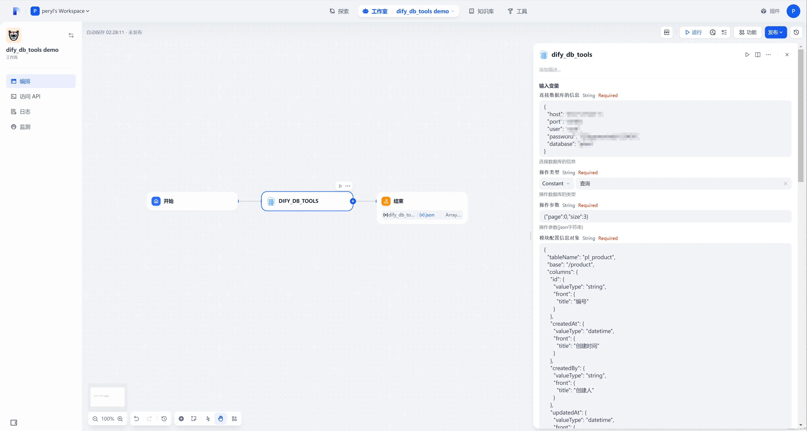

执行结果：

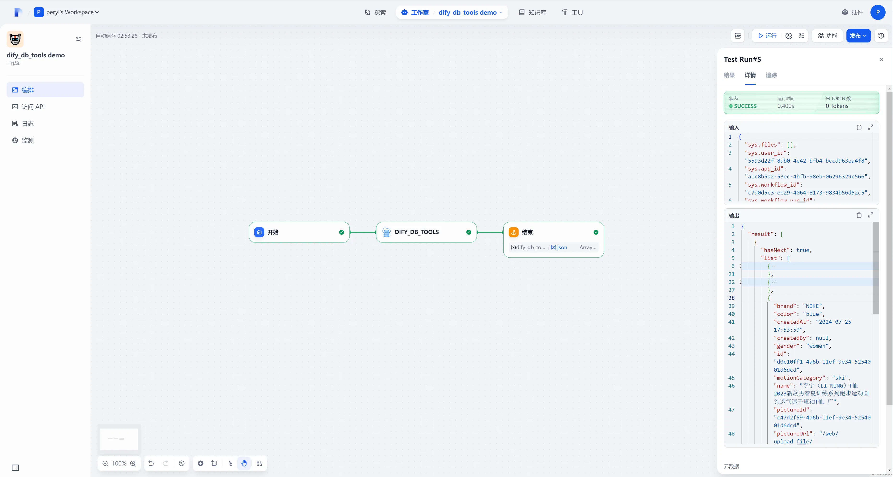

也可以用接口调用工具来执行工作流获取执行结果：

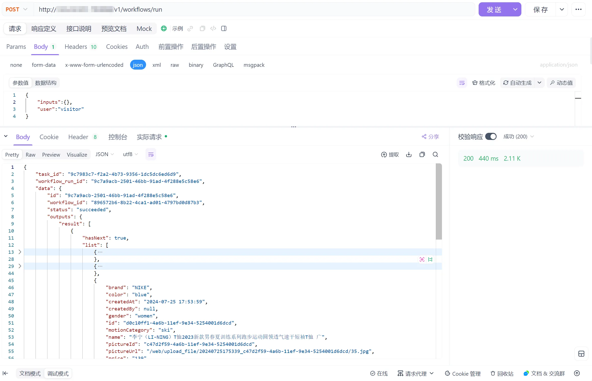

### 声明
本插件只有在配置阶段，**需要数据库连接信息以及表结构信息等敏感数据**，只会使用这些数据信息连接数据库以及对数据库表进行操作，不会收集其他任何敏感数据，比如个人信息、用户名密码、邮箱地址等等；并且也不会存在上传任何数据到任何服务器的行为，代码完全开源接受市场监督；

### 表结构信息
如下所示，是一个简单的商品表结构信息json描述：

```json
{
  "tableName": "pl_product",
  "base": "/product",
  "columns": {
    "id": {"valueType": "string", "front": {"title": "编号"}}, 
    "createdAt": {"valueType": "datetime", "front": {"title": "创建时间"}},
    "createdBy": {"valueType": "string", "front": {"title": "创建人"}},
    "updatedAt": {"valueType": "datetime", "front": {"title": "更新时间"}},
    "updatedBy": {"valueType": "string", "front": {"title": "更新人"}},
    "name": {"valueType": "string", "front": {"title": "商品名称"}},
    "pictureId": {"valueType": "number", "front": {"title": "商品图片id"}},
    "pictureUrl": {"front": {"title": "商品图片"}, "valueType": "string", "query": "t2.path"},
    "price": {"valueType": "number", "front": {"title": "商品价格"}},
    "gender": {"valueType": "string", "front": {"title": "商品性别偏好"}},
    "productCategory": {"valueType": "string", "front": {"title": "商品类别"}},
    "brand": {"valueType": "string", "front": {"title": "商品所属品牌"}},
    "motionCategory": {"valueType": "string", "front": {"title": "商品运动类型"}},
    "color": {"valueType": "string", "front": {"title": "商品颜色"}}
  },
  "joinConfig": [
    {
      "type": "left join",
      "table": "pl_upload",
      "alia": "t2",
      "on": "t1.picture_id = t2.id"
    }
  ]
}
```

+ **tableName**：数据库中的表名；
+ **base**：表所属业务模块标识，这个字段在这个插件中目前没有作用，但是最好不要省略这个值；
+ **columns**：字段信息，是一个对象，对象的key为字段的标识名称（必须用驼峰命名），对象值有四个属性：valueType，query，convert，front；
    - **valueType**：字段类型，可选值如下所示：
        * **string**：字符串；
        * **number**：数字；
        * **date**：YYYY-MM-DD格式的字符串（实际上mysql数据库字段类型为datetime，查询时会格式化为YYYY-MM-DD返回）；
        * **datetime**：YYYY-MM-DD HH:mm:ss格式的字符串（实际上mysql数据库字段类型为datetime，查询时会格式化为YYYY-MM-DD HH:mm:ss返回）；
        * **time**：HH:mm:ss格式的字符串（实际上mysql数据库字段类型为time，查询时会格式化为HH:mm:ss返回）；
    - **query**：
        * 查询字段名，缺省的情况下，会将key（驼峰命名）转化成下划线命名，配上前缀"t1."作为字段的query，比如字段“createdAt”的缺省query为“t1.created_at”；
        * 如果某些字段是关联而来的，那么需要写上这个query值，比如商品表中，picture_id字段存储商品图片的id，图片信息是作为附件对象存储在附件表（pl_upload）中的，那么图片地址pictureUrl就需要用picture_id来关联附件表，取附件表的path（附件地址）来作为图片地址返回；因为下面joinConfig中设置了附件表（pl_upload）的别名是“t2”，所以pictureUrl的query就是“t2.path”；
    - **convert**：一些多值的字段，在后端存储是字符串，在前端使用的时候是数组；比如一个人可能有多种性格“乐观,聒噪,好动”，值是以json数组字符串或者以逗号连接的字符串存储在表字段中；因为前端使用时，以及前端传参时，都需要将这个值转化为数组，这里支持配置自动转化值；配置了之后，查询表数据时会自动将字段值从字符串转化为数组；字符串有两种形式，如下所示：
        * arrayjson：存储值的格式为json数组字符串
        * arraystring：存储值的格式为使用逗号连接的字符串；
    - **front**: 前端渲染所需要的一些配置信息，可以忽略；
+ **joinConfig**：关联表信息，是一个数组；
    - **type**：关联方式，可选值：left join, right join, join；
    - **table**：关联的表名；
    - **alia**：关联表别名；
    - **on**：关联条件；

### 操作类型
本节会讲解每种操作类型的细节，参数规则等等。如果希望实现动态操作类型，可以阅读末尾的【扩展用法】章节；

#### 查询
当操作类型为查询时，参数规则如下所示：

```json
{
    "page": 0,
    "size": 11,
    "filters": [
        {
            "field": "count",
            "value": 10,
            "operator": "<=",
            "id": "FF_1"
        },
        {
            "field": "numberVal",
            "value": 500,
            "operator": ">=",
            "id": "FF_2"
        }
    ],
    "filterExpression": "(FF_1 or FF_2)",
    "orders": [
        {
            "field": "count",
            "desc": false
        },
        {
            "field": "numberVal",
            "desc": true
        }
    ]
}
```

1. page：为查询的页，从0开始；
2. size：为页大小；
3. filters：筛选参数，下面会详细介绍筛选参数；
4. filterExpression：为筛选表达式，当筛选需要使用or等方式连接时，可以传入这个表达式；
5. orders：排序参数，支持多字段排序；

##### 筛选参数：
是一个对象，有四个属性：

+ id：筛选的标识，当filterExpression存在时这个不能为空；
+ value：筛选的值；
+ operator：筛选操作符；
+ field：筛选的字段名称（驼峰命名）；

当字段类型（valueType）为string时，operator支持以下操作符：

+ =：等于
+ !=：不等于
+ ~：类似于，也就是模糊查询（like '%?%'）
+ in：包含，此时value必须是数组；
+ not in：不包含：此时value必须是数组
+ in like：模糊包含，此时value必须是数组，会转化成 （like '%?%'）**or** （like '%?%'）...的方式筛选
+ not in like：模糊不包含，会转化成 （not like '%?%'）**and**（not like '%?%'）...的方式筛选
+ is null：值为空（空字符串可能无法筛选）
+ is not null：值不为空；

当字段类型（valueType）为number时，operator支持以下操作符：

+ =：等于
+ !=：不等于
+ ~：类似于，模糊查询，同string的~
+ >：大于
+ >=：大于等于
+ <：小于
+ <=：小于等于
+ in：包含，同string的in
+ not in：不包含，同string的not in
+ in like：模糊包含，同string 的in like
+ not in like：模糊不包含，同string的 not in like
+ is null：为空
+ is not null：不为空

当字段类型（valueType）为date时，operator支持以下操作符：

+ =：等于
+ ~：非模糊查询，效果与“=”形同；
+ !=：不等于
+ >：大于
+ >=：大于等于
+ <：小于
+ <=：小于等于
+ in：包含
+ in like：同“in”
+ not in：不包含
+ not in like：同“not in”
+ is null：为空
+ is not null：不为空

当字段类型（valueType）为time时，operator同（valueType）为date；

当字段类型（valueType）为datetime时，operator同（valueType）为date；

##### 筛选表达式
当筛选条件为动态时，可以用表达式来控制筛选sql的生成，如下参数所示：

```json
{
  "page": 0,
  "size": 11,
  "filters": [
    {"field": "normalText","value": "rose","operator": "~","id": "FF_1"},
    {"field": "count", "value": "10","operator": "<=","id": "FF_2"},
    {"field": "numberVal","value": "500","operator": ">=","id": "FF_3"}
  ],
  "filterExpression": "(FF_1 and (FF_2 or FF_3))"
}
```

这个参数生成的sql如下所示：

```sql
select t1.id as 'id',date_format(t1.created_at, '%Y-%m-%d %H:%i:%%s') as 'createdAt',t1.created_by as 'createdBy',date_format(t1.updated_at, '%Y-%m-%d %H:%i:%%s') as 'updatedAt',t1.updated_by as 'updatedBy',t1.count as 'count',t1.normal_text as 'normalText',t1.long_text as 'longText',t1.number_val as 'numberVal',t1.flag as 'flag',t1.select_val as 'selectVal',t1.color_val as 'colorVal',date_format(t1.date_val, '%Y-%m-%d') as 'dateVal',date_format(t1.time_val, '%H:%i:%%s') as 'timeVal',t1.parent_id as 'parentId',t1.image_id as 'imageId',t2.normal_text as 'parentName',t1.province_val as 'provinceVal',t1.city_val as 'cityVal',t1.district_val as 'districtVal',t1.ov_val as 'ovVal',t1.array_json as 'arrayJson',t1.array_string as 'arrayString',t1.array_json_str as 'arrayJsonStr',t1.array_string_str as 'arrayStringStr' 

from pl_demo t1 left join pl_demo t2 on t1.parent_id = t2.id 

where (t1.normal_text like %s and (t1.count <= %s or t1.number_val >= %s)) 

order by t1.created_at desc limit %s,%s
```

```json
["%rose%", "10", "500", 0, 12]
```

如代码所示，where条件实际上是由 filterExpression 生成的，注意的是为了避免存在sql注入的问题，filterExpression中除了“and”“or”等关键字之外，其他所有字符都试为filter对象的id，通过正则的方式替换；比如 “(FF_1 and (FF_2 or FF_3)) or 1=1”这样试图绕过筛选条件的句子是不行的，会将1=1视为filter id进行替换，从而导致sql语法异常无法查询；

##### 去重查询
当你需要根据某些字段进行去重查询时，参数如下所示：

```json
{
  "page": 0,
  "size": 10,
  "distinctFields": [
    "count"
  ]
}
```

查询结果如下所：

```json
[
  {
    "count": 111
  },
  {
    "count": 678
  },
  {
    "count": 296
  },
  {
    "count": 409
  },
  {
    "count": 347
  },
  {
    "count": 202
  },
  {
    "count": 206
  },
  {
    "count": 203
  },
  {
    "count": 200
  },
  {
    "count": 21
  }
]
```

##### 查询总数
当你需要查询总数，而不是查询数据对象时，请设置 "onlyCount"为true，此时page以及size等分页参数以及排序参数将无效；筛选参数、去重参数依然有效；

```json
{
  "onlyCount":true,
  "filters": [
    {"field": "count", "value": "200","operator": ">="}
  ]
}
```

返回结果：

```json
{
    "total": 16
}
```

##### 不分页查询
当你需要不分页查询所有数据时，只需要设置“all”为true；

#### 查询单条
查询单条数据沿用的是“查询”功能，只不过请求参数做了便捷式处理，当操作类型为查询单条时，可以通过设置一些简单的字段值来查询目标记录，比如要查询id为“abc”的记录，那么查询参数只需要这么写：

```json
{"id":"abc"}
```

会自动生成筛选条件：{"field":"id","operator":"=","value":"abc","id":"F_!"}，如果请求参数有多个key以及对应的value，那么也会生成多个筛选条件对象；

#### 新建
当操作类型为新建时，需要将新建的对象放在请求参数的row属性上，如下所示：

```json
{
    "row": {
        "fullName": "海森堡",
        "username": "handsomeboy"
    }
}
```

插入数据成功之后，会返回新的数据对象，如下所示：

```json
{
    "result": {
        "createdAt": "2025-04-29 17:02:34",
        "createdBy": null,
        "fullName": "海森堡",
        "id": "b0a579e1-24d8-11f0-9e22-5254001d6dcd",
        "memberEnd": null,
        "memberStart": null,
        "password": null,
        "updatedAt": "2025-04-29 17:02:34",
        "updatedBy": null,
        "username": "handsomeboy"
    }
}
```

#### 批量新建
当操作类型为批量新建时，需要将批量新建的对象数组放在请求参数的rows属性上，如下所示：

```json
{
    "rows": [
        {
            "fullName": "hello1",
            "username": "world2"
        },
        {
            "fullName": "hello3",
            "username": "world4"
        }
    ]
}
```

```json
{
    "result": [
        {
            "createdAt": "2025-04-29 17:23:04",
            "createdBy": null,
            "fullName": "hello1",
            "id": "8e129602-24db-11f0-9e22-5254001d6dcd",
            "memberEnd": null,
            "memberStart": null,
            "password": null,
            "updatedAt": "2025-04-29 17:23:04",
            "updatedBy": null,
            "username": "world2"
        },
        {
            "createdAt": "2025-04-29 17:23:04",
            "createdBy": null,
            "fullName": "hello3",
            "id": "8e194a4f-24db-11f0-9e22-5254001d6dcd",
            "memberEnd": null,
            "memberStart": null,
            "password": null,
            "updatedAt": "2025-04-29 17:23:04",
            "updatedBy": null,
            "username": "world4"
        }
    ]
}
```

批量新建是开启事务的，如果其中一条数据插入失败，所有数据都不会插入成功，比如示例中的fullName以及userName都是not null字段，如果请求参数缺少值，如下所示：

```json
{
    "rows": [
        {
            "fullName": "hello1",
            "username": "world2"
        },
        {
            "fullName": "hello3"
        }
    ]
}
```

```json
{
    "error": "Error: 1364 (HY000): Field 'username' doesn't have a default value"
}
```

#### 更新
当操作类型为更新时，参数格式与新建一致，不过注意的是更新对象必须包含id字段值，不能为空；

不同于新建只能设置row参数，更新除了设置row参数之外还支持设置updateFields参数，是一个字段标识字符串数组，表示仅更新哪些字段；

返回数据类型与新建时的返回数据类型一致；

#### 批量更新
请求参数格式与批量新建一致，注意的是每条更新的数据的id字段值都不能为空；同样的有事务控制，只要有一条数据新建失败，就会回滚，返回数据结构类型与批量新建一致；

#### 删除
删除操作支持删除单条数据以及删除多条数据，请求参数如下所示：

```json
{"id":"049916e2-24db-11f0-9e22-5254001d6dcd"}
```

```json
{
  "id":[
    "049ff2d5-24db-11f0-9e22-5254001d6dcd",
    "2cd24b09-24db-11f0-9e22-5254001d6dcd",
    "2cd86bee-24db-11f0-9e22-5254001d6dcd"
  ]
}
```

```json
{
    "deletedRows": 3
}
```

deletedRows表示删除的数据条数；

### 扩展用法
开头的示例，展示了如何实现查询固定表的使用方式；这里演示如何通过配置可以实现一个dify工作流对任意表进行增删改查功能；首先是需要有一张表，存储所有需要操作的表的表结构信息，ddl如下所示：

```sql
create or replace table plain.pl_module
(
    id            varchar(50) default uuid()              not null comment '编号' primary key,
    created_at    datetime    default current_timestamp() null comment '创建时间',
    created_by    varchar(50)                             null comment '创建人id',
    updated_at    datetime    default current_timestamp() null comment '最后更新时间',
    updated_by    varchar(50)                             null comment '最后更新人id',
    label         varchar(100)                            null comment '模块名称',
    code          varchar(20)                             null comment '模块标识',
    remarks       longtext                                null comment '模块备注',
    module_config longtext                                null comment '模块配置json信息',
    constraint pl_module_id_uindex unique (id)
);


```

在这个表中维护数据，如下所示：

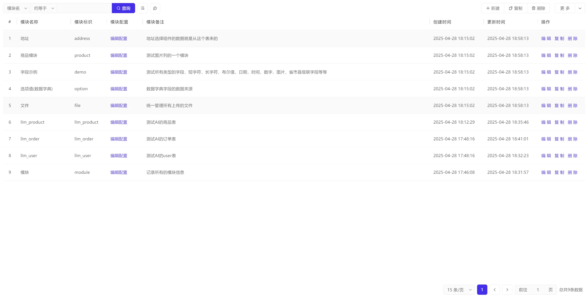

点击编辑配置按钮可以编辑该表的表结构信息：

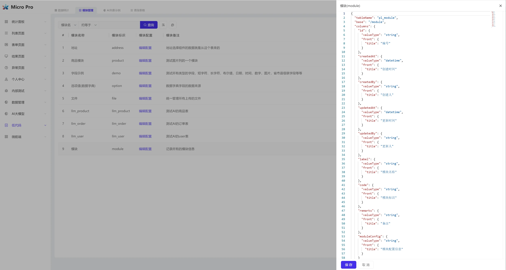

接下来是讲解编排的实现方式，简单原理就是，工作流开始节点接受三个参数：operateType、operateData、module；

1. operateType：操作类型，对应上边的操作类型，选项为：query、item、insert、update、batchInsert、batchUpdate、delete七种；
2. operateData：操作的参数，受限于dify工作流参数规则限制，这里只能是字符串，所以得把参数对象转化成json字符串；
3. module：要操作的表（模块）；

编排如下所示：

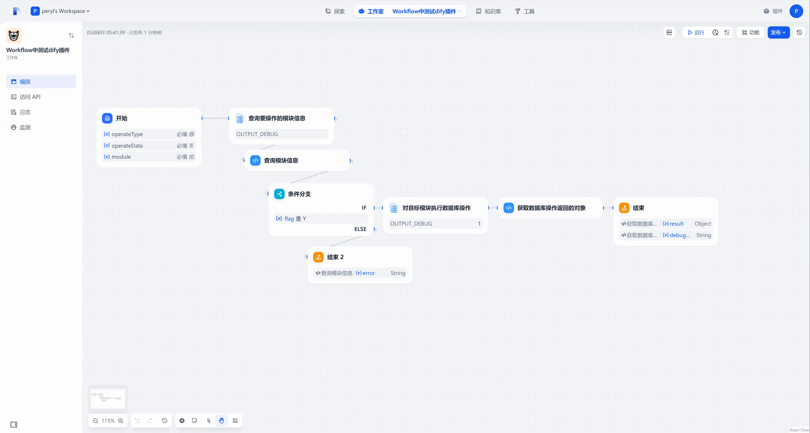

首先是开始节点，定义三个参数，其中operateType是下拉选项单选，其他两个是字符串；

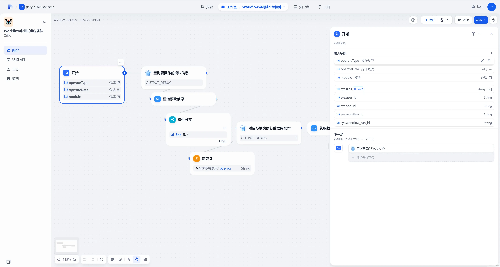

然后是进入到第一个dify_db_tools插件，这个插件的操作类型是“查询单条”，根据开始节点给的module，查出来需要操作的表（模块）的表结构信息：

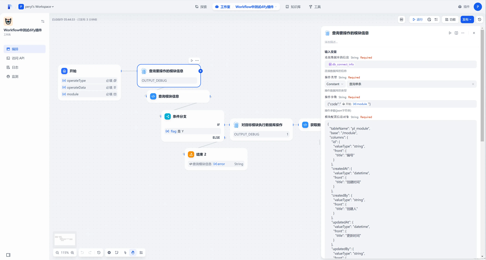

然后是到“代码执行”节点，也就是图中的“查询模块信息”，这个代码执行的作用是判断是否查出来目标的表结构信息，将moduleConfig、error解析出来，并且返回一个flag标识用来判断查询是否成功：  
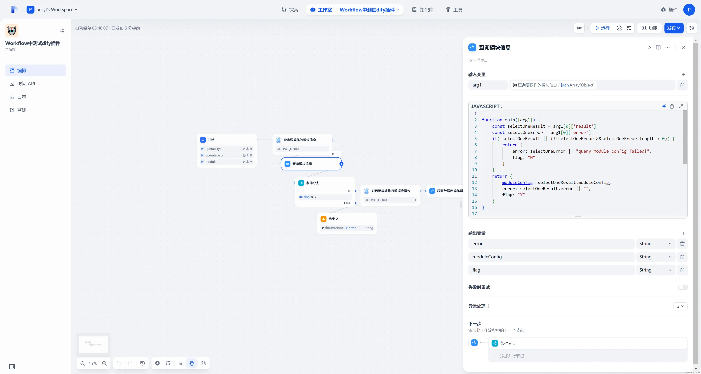

然后是进入条件分支节点，如果刚解析得到的flag是N，则直接结束并且将错误信息返回；

如果解析得到的flag是Y，则进入到下一个dify_db_tools节点，如下所示，

这个dify_db_tools节点的操作类型从开始节点取operateType参数，操作参数从开始节点取operateData参数；

表模块配置信息则从刚刚查询出来的moduleConfig获取；

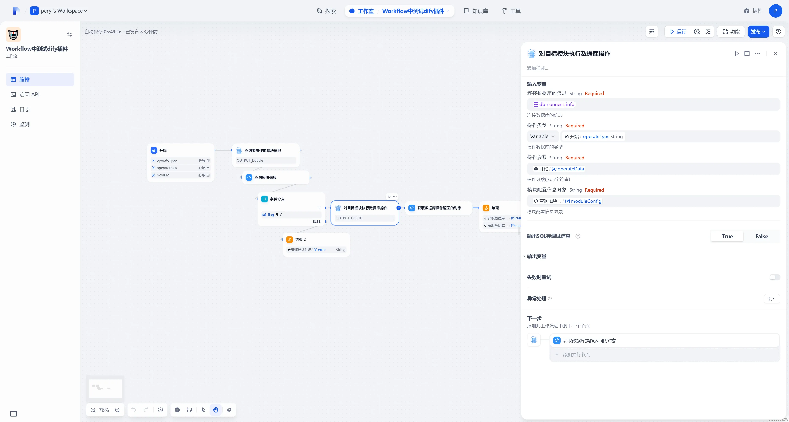

然后是进入到代码执行器“获取数据库操作返回的对象”，代码的作用是将返回的debugData转化成字符串返回；由于dify平台的限制，返回的数据中不能存在多维数组的情况，也就是数组的元素不能是数组，导致这里会出现异常；因为当批量新建、批量编辑时，这里输出的debug_data如下所示，是一个二维数组：

```json
[
    {
        "sql": "insert into llm_user ( id, full_name, username )  values ( %s, %s, %s )",
        "values": [
            "f19d2ffe-24df-11f0-9e22-5254001d6dcd",
            "hello1",
            "world2"
        ]
    },
    {
        "sql": "insert into llm_user ( id, full_name )  values ( %s, %s )",
        "values": [
            "f1a39106-24df-11f0-9e22-5254001d6dcd",
            "hello3"
        ]
    }
]
```

会导致在dify编排中出现异常，解决办法只能是转化成字符串；

然后就可以进行使用了，发布更新之后，点击运行打开工作流的执行界面，比如查询llm_user表数据，不穿入分页参数，默认查第一页，每页5条数据；

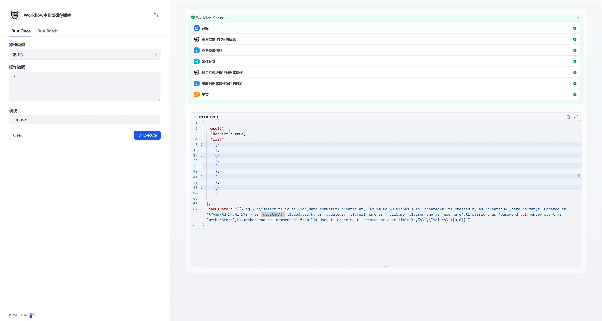

在API调试工具中执行：

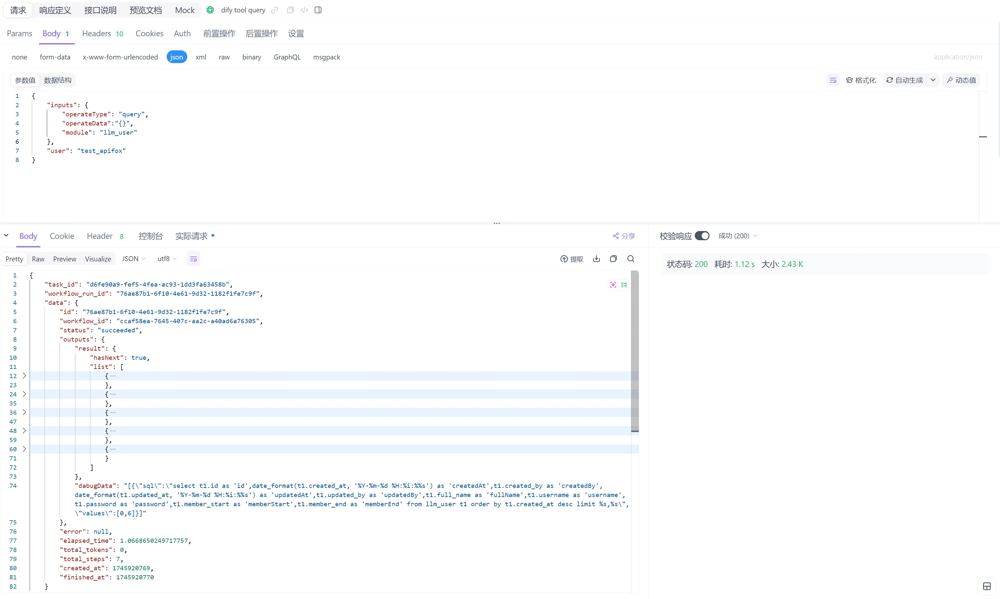

插入一条数据：

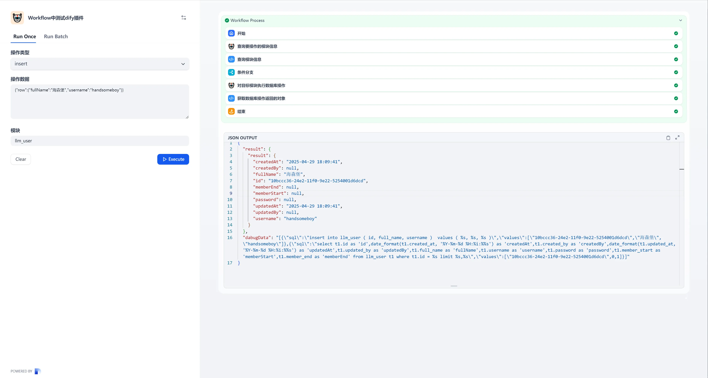

在调试工具中调用：

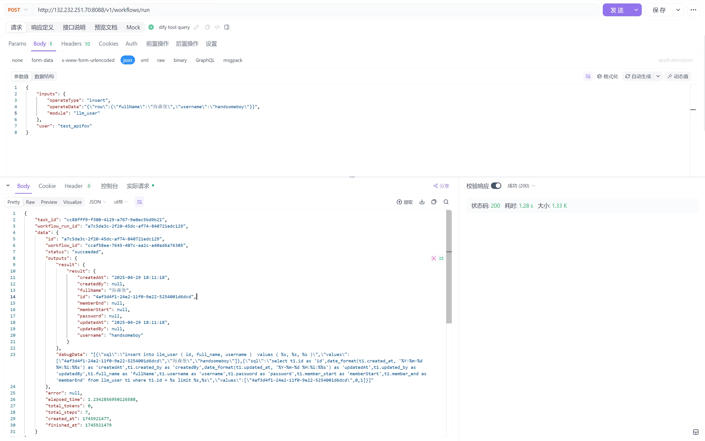

